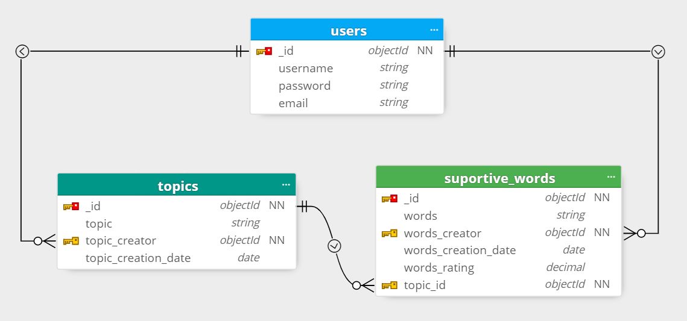
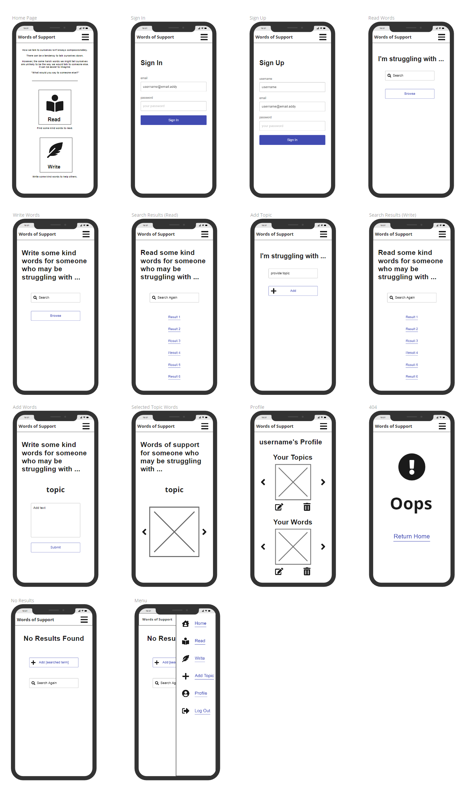

# Words of Support

How we talk to ourselves and the words we use have a huge impact on the way we feel. It isn't always the easiest to talk compassionately to yourself. There can be a tendency to talk ourselves down in our own heads. However, the same harsh words we might tell ourselves are highly unlikely to be the way we would address someone else. It can often be easier to imagine "What would you say to someone else?" when trying to find kind words for yourself.

By imagining the other it can be easier to place yourself in a caring, supportive position and find the appropriate words. *Words of Support*'s aim is to provide a platform for that type of engagement. Helping people reduce the space for negative ways of addressing themselves by experiencing more positive ones, either by reading supportive words submitted by others, or by crafting words designed to by supportive of others.

If you are contributing to *Words of Support* you are potentially providing direct support to someone or many people who need it, something that in itself is helpful to your own wellbeing.

Looking at the ['5 steps to wellbeing'](https://www.nhs.uk/mental-health/self-help/guides-tools-and-activities/five-steps-to-mental-wellbeing/) on the NHS website, we're ticking at least two (maybe three?) of those boxes.
1. Connect with other people :heavy_check_mark:
2. Be physically active
3. Learn new skills 
4. Give to others :heavy_check_mark:
5. Pay attention to the present moment (mindfulness) :white_check_mark:

Try it yourself.  
Add a topic that you or someone else might be struggling with.  
See what topics people are struggling with.  
Write some words of support for topics you or others have added.

**The live project is available on Heroku: [Words of Support](#)**

## Table of Contents
- [User Experience Design](#user-experience-design)
  * [Strategy](#strategy)
  * [Scope](#scope)
    + [User Stories](#user-stories)
  * [Structure](#structure)
  * [Skeleton](#skeleton)
	+ [Database Design](#database-design)
    + [Navigation Tree](#navigation-tree)
    + [Wireframes](#wireframes)
  * [Surface](#surface)
- [Features](#features)
  * [Current Features](#current-features)
  * [Future Features](#future-features)
- [Technologies Used](#technologies-used)
  * [Languages](#languages)
  * [Libraries](#libraries)
  * [APIs](#apis)
  * [Other Services and Software](#other-services-and-software)
- [Testing](#testing)
- [Deployment Instructions](#deployment-instructions)
- [Acknowledgements](#acknowledgements)
  * [Content](#content)
  * [Media](#media)
  * [Thanks](#thanks)

## User Experience Design

### Strategy

*Words of Support*'s aim is provide positive cognitive value to it's users. It should serve as an opportunity for mindful interaction with positive ideas.
Value is to be obtained by:
- Finding submitted words of support for a given topic  
Reading custom messages written for a given subject can provide reassurance to the user.
- Writing custom messages got a given topic  
Sharing kind words for others is part of the [steps to wellbeing](https://www.nhs.uk/mental-health/self-help/guides-tools-and-activities/five-steps-to-mental-wellbeing/).
>  - creating positive feelings and a sense of reward
>  - giving you a feeling of purpose and self-worth
>  - helping you connect with other people

More and more have we become aware of the importance of mental health. *Words of Support* can provide a way to place some focus on the importance of a caring attitude and kind words.

### Scope

The project will make use of a interactive graphical frontend, programmatic logic and backend database to achieve its aim.
The frontend design shall be inviting and intuitive, allowing the user access to create and read records from the database, as well as update and delete records where appropriate. (Content created by themselves when logged in.)
Server side logic will control access to the database and what will be presented on the front end. Through use of functions and compound statements appropriate data from the database will be married with HTML to display to the user.
A document orientated database will house the data inputted by the users to be managed via the frontend.

Topics (issues someone may be struggling with) will be paired with supportive words (user submitted text, examples of "What would you say to someone experiencing this issue?").
Users will be able to find supportive words by their attached topic, as well as submit both new topics and supportive words.
Users will also be able to manage the content that they have submitted themselves by logging in and reviewing a personal history of submissions.

#### User Stories

| Scenario | Requirements  |
|----------|---------------|
| **As a person struggling with negative self thoughts**, I want to read uplifting comments that help me have more positive thoughts. | There should be these type of comments and they need to be simple to access. |
| I want to be able to see comments specific to particular issues. | The content filtered in some way by issue.|
| I want to be able to specify which particular issue I want to see comments related to. | A way for the user to find content that they're looking for.|
| **As a person wanting to be more actively positive**, I want write something positive. | The ability to submit content. |
| I want other people to be able to have the opportunity to gain value from what I write.  | The content submitted by users need to be discoverable by other users.|
| I want what I write to be meaningful for people. | To provide a context where people can have access to the content provided in a way that can benefit them.|
| **As a user**, I want to be able to retain control over the content that I provide. | Requirement. |
| I want to be able to gain access to see what I have submitted. | A form of user access.|
| I want to be able to update or delete the content that I have submitted. | User limited content control facility.|

### Structure

The project will make us of a document database with Mongo DB in order to store content and user account information.
Information will be presented across web pages an data collected using forms. A navigation menu will allow users to select specific actions and there will be pathways between pages to perform the different steps of some of the actions, such as collecting and then displaying information.

### Skeleton

There are three related collections within the database.
1. Users  
Contains the user account information that will facilitate access restrictions to how and when users can add, delete or update from the database.
2. Topics  
Contains the subjects that people might be experiencing issues with that users will be able to see and provide supportive words associated to that subject.
3. Words  
Contains the supportive words submitted by the users.

Despite the use of a document database there are be relationships between the collections, enforced via Python logic.
There are two types of relationship:
1. Both topics and words will have a single associated user who has created them.
2. Words will have a single associated topic.

#### Database Design

#### Navigation Tree

#### Wireframes

Wireframes showing layout plans for different devices.

The complete set of wireframes can be viewed via these images:
 - [Mobile Wireframes](assets/wireframes/mobile-wireframes.png)
 - [Tablet Wireframes](assets/wireframes/tablet-wireframes.png)
 - [Desktop Wireframes](assets/wireframes/desktop-wireframes.png)

### Surface

Surface considerations. 

## Features

Features of project

### Current Features
These features have been implemented in the project.

 - Feature
	 * Feature detail.
	 * Feature detail.
	 

 - Feature
	 * Feature detail.
	 * Feature detail.
	 

 - Feature
	 * Feature detail.
	 * Feature detail.
	 

 - Feature
	 * Feature detail.
	 * Feature detail.
	 

### Future Features
Possible features to be considered for future releases.
 - Feature
	 * Feature detail.
	 * Feature detail.

 - Feature
	 * Feature detail.
	 * Feature detail.
     * Feature detail.

 - Feature
	 * Feature detail.
 
 - Feature
	 * Feature detail.

 - Feature
	 * Feature detail.

## Technologies Used
### Languages
 - HTML 
 - CSS
 - JavaScript
 - xxxxx
 - xxxxx

### Libraries
 - [jQuery](https://jquery.com/)
 - [Link](#)

 ### APIs
 - [Link](#)
 
### Other Services and Software
 - Git
 	 - Version control.
 - GitHub
 	 - Cloud-based storage and deployment via GitHub Pages.
 - GitPod
 	 - IDE.
 - [StackEdit](https://stackedit.io)
	 - Used to assist in the planning and creation of this README markdown file.
 - [markdown-toc](https://ecotrust-canada.github.io/markdown-toc)
	 - Used to generate table of contents in markdown for this README markdown file.
 - [Moon Modeler](https://www.datensen.com/data-modeling/moon-modeler-for-databases.html)
	 - For creating the database diagram.
 - [Link](#)
	 - For xxxxx.
 - [Link](#)
	 - For xxxxx.
 - [Link](#)
	 - For xxxxx.
 - [Link](#)
	 - For xxxxx.
 - [Link](#)
	 - For xxxxx.

## Testing

See separate [TESTING.md](TESTING.md)

## Deployment Instructions

Forking a Repository
1. Navigate to GitHub Repository
2. Use the **Fork** link (node tree icon) from the top right of the page justunder the header.
3. You now have a copy of the repository among your own.

[Further Instruction](https://help.github.com/articles/fork-a-repo)

Cloning a Repository
1. Navigate to GitHub Repository
2. Use the **Code** dropdown button from just above the repository on the right.
3. Copy the relevant address or command to use as instructed with your chosen method.
4. For example in Git Bash use the command `$ git clone https://github.com/`**github-username**`/`**repository-name**
5. You now have a local copy of the Repository in the directory where you ran the command.

[Further Instruction](https://help.github.com/articles/cloning-a-repository/)

GitHubPages

 1. Navigate to GitHub Repository
 2. Use the **Settings** link (cog icon) from the menu atop the repository.
 3. Use the **Pages** link from the left hand navigation menu.
 4. Select **Branch: master** as the source.
 5. Click **Save**
 6. The site can be found at the address `https://`**github-username**`.github.io/`**repository-name**

[Further Instruction](https://docs.github.com/en/pages/getting-started-with-github-pages/creating-a-github-pages-site#creating-your-site)

## Acknowledgements

### Content

Reused or inspired code from the following sources:
 - [StackOverflow Questions & Answers](https://stackoverflow.com/questions/) various, links to specifics in code.
 - [Medium](https://medium.com/) linked to specific in code.

 Used for referencing:
 - [MDN Web Docs](https://developer.mozilla.org/en-US/)
 - [W3 Schools](https://www.w3schools.com/)

### Media

 - [Link](#) by [Name](#)
 used as XXXX.
 - [Link](#) by [Name](#)
 used as XXXX.
 - [Link](#) by [Name](#)
 used as XXXX.
 - [Link](#) by [Name](#)
 used as XXXX.
 - [Link](#) by [Name](#)
 used as XXXX.
 - [Link](#) by [Name](#)
 used as XXXX.
 - [Link](#) by [Lia-Aramburu](https://www.vecteezy.com/members/lia-aramburu) via [Name](#)
 used as xxxxx.
 - [Link](#) by [Lia-Aramburu](https://www.vecteezy.com/members/lia-aramburu) via [Name](#)
 used as xxxxx.
 - Mockups Screenshot from [Am I Responsive](http://ami.responsivedesign.is/)
 - Emoji used for favicon.ico is part of [Twemoji](https://twemoji.twitter.com/)

### Thanks

 - Code Institute
 - My Code Institute Mentor
 - My Long Suffering Partner