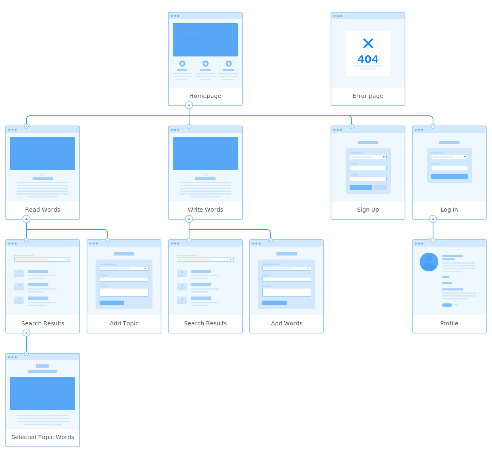

# Words of Support

How we talk to ourselves and the words we use have a huge impact on the way we feel. It isn't always the easiest to talk compassionately to yourself. There can be a tendency to talk ourselves down in our own heads. However, the same harsh words we might tell ourselves are highly unlikely to be the way we would address someone else. It can often be easier to imagine "What would you say to someone else?" when trying to find kind words for yourself.

By imagining the other it can be easier to place yourself in a caring, supportive position and find the appropriate words. *Words of Support*'s aim is to provide a platform for that type of engagement. Helping people reduce the space for negative ways of addressing themselves by experiencing more positive ones, either by reading supportive words submitted by others, or by crafting words designed to by supportive of others.

If you are contributing to *Words of Support* you are potentially providing direct support to someone or many people who need it, something that in itself is helpful to your own wellbeing.

Looking at the ['5 steps to wellbeing'](https://www.nhs.uk/mental-health/self-help/guides-tools-and-activities/five-steps-to-mental-wellbeing/) on the NHS website, we're ticking at least two (maybe three?) of those boxes.
1. Connect with other people :heavy_check_mark:
2. Be physically active
3. Learn new skills 
4. Give to others :heavy_check_mark:
5. Pay attention to the present moment (mindfulness) :white_check_mark:

Try it yourself.  
Add a topic that you or someone else might be struggling with.  
See what topics people are struggling with.  
Write some words of support for topics you or others have added.

**The live project is available on Heroku: [Words of Support](https://words-of-support.herokuapp.com)**


## Table of Contents
- [User Experience Design](#user-experience-design)
  * [Strategy](#strategy)
  * [Scope](#scope)
    + [User Stories](#user-stories)
  * [Structure](#structure)
  * [Skeleton](#skeleton)
	+ [Database Design](#database-design)
    + [Sitemap](#sitemap)
    + [Wireframes](#wireframes)
  * [Surface](#surface)
- [Features](#features)
  * [Current Features](#current-features)
  * [Future Features](#future-features)
- [Technologies Used](#technologies-used)
  * [Languages](#languages)
  * [Libraries](#libraries)
  * [Frameworks](#frameworks)
  * [Other Services and Software](#other-services-and-software)
- [Testing](#testing)
- [Deployment Instructions](#deployment-instructions)
- [Acknowledgements](#acknowledgements)
  * [Content](#content)
  * [Media](#media)
  * [Thanks](#thanks)

## User Experience Design


### Strategy

*Words of Support*'s aim is provide positive cognitive value to it's users. It should serve as an opportunity for mindful interaction with positive ideas.
Value is to be obtained by:
- Finding submitted words of support for a given topic  
Reading custom messages written for a given subject can provide reassurance to the user.
- Writing custom messages got a given topic  
Sharing kind words for others is part of the [steps to wellbeing](https://www.nhs.uk/mental-health/self-help/guides-tools-and-activities/five-steps-to-mental-wellbeing/).
>  - creating positive feelings and a sense of reward
>  - giving you a feeling of purpose and self-worth
>  - helping you connect with other people

More and more have we become aware of the importance of mental health. *Words of Support* can provide a way to place some focus on the importance of a caring attitude and kind words.

### Scope

The project will make use of a interactive graphical frontend, programmatic logic and backend database to achieve its aim.
The frontend design shall be inviting and intuitive, allowing the user access to create and read records from the database, as well as update and delete records where appropriate. (Content created by themselves when logged in.)
Server side logic will control access to the database and what will be presented on the front end. Through use of functions and compound statements appropriate data from the database will be married with HTML to display to the user.
A document orientated database will house the data inputted by the users to be managed via the frontend.

Topics (issues someone may be struggling with) will be paired with supportive words (user submitted text, examples of "What would you say to someone experiencing this issue?").
Users will be able to find supportive words by their attached topic, as well as submit both new topics and supportive words.
Users will also be able to manage the content that they have submitted themselves by logging in and reviewing a personal history of submissions.

#### User Stories

| Scenario | Requirements  |
|----------|---------------|
| **As a person struggling with negative self thoughts**, I want to read uplifting comments that help me have more positive thoughts. | There should be these type of comments and they need to be simple to access. |
| I want to be able to see comments specific to particular issues. | The content filtered in some way by issue.|
| I want to be able to specify which particular issue I want to see comments related to. | A way for the user to find content that they're looking for.|
| **As a person wanting to be more actively positive**, I want write something positive. | The ability to submit content. |
| I want other people to be able to have the opportunity to gain value from what I write.  | The content submitted by users need to be discoverable by other users.|
| I want what I write to be meaningful for people. | To provide a context where people can have access to the content provided in a way that can benefit them.|
| **As a user**, I want to be able to retain control over the content that I provide. | Requirement. |
| I want to be able to gain access to see what I have submitted. | A form of user access.|
| I want to be able to update or delete the content that I have submitted. | User limited content control facility.|

### Structure

The project will make us of a document database with Mongo DB in order to store content and user account information.
Information will be presented across web pages an data collected using forms. A navigation menu will allow users to select specific actions and there will be pathways between pages to perform the different steps of some of the actions, such as collecting and then displaying information.

### Skeleton

There are three related collections within the database.
1. Users  
Contains the user account information that will facilitate access restrictions to how and when users can add, delete or update from the database.
2. Topics  
Contains the subjects that people might be experiencing issues with that users will be able to see and provide supportive words associated to that subject.
3. Words  
Contains the supportive words submitted by the users.

Despite the use of a document database there are be relationships between the collections, enforced via Python logic.
There are two types of relationship:
1. Both topics and words will have a single associated user who has created them.
2. Words will have a single associated topic.

#### Database Design


Navigation will be via two main forms. Either through direct access to desired pages via the menu for those more familiar with the site, or through the navigation flow offered by the content on the pages.
The main page will offer two pathways into the site marked by the users desired interest to either read/find supportive words (access data form the database) or contribute supportive words (add or manage data in the database).
Taking either path with have opportunities to jump to the other and also prompt users to log in where required.
Users will be able to read content, but will need to be logged in to submit content.

The navigation menu will appear differently depending on if a user is logged in or not.
| Menu Item | Not Logged In | Logged In |
|----------|---------------|---------------|
| Home | :heavy_check_mark: | :heavy_check_mark: |
| Read | :heavy_check_mark: | :heavy_check_mark: |
| Write | :heavy_check_mark: (redirects to Log In) | :heavy_check_mark: |
| Add Topic | :heavy_check_mark: (redirects to Log In) | :heavy_check_mark: |
| Profile | :x: | :heavy_check_mark: |
| Sign Up | :heavy_check_mark: | :x: |
| Log In | :heavy_check_mark: | :x: |
| Log Out | :x: | :heavy_check_mark: |

#### Sitemap



#### Wireframes

Wireframes showing layout plans.


### Surface

Choices for the visual style of the project are to present a calm, somewhat neutral, non-clinical tone.
Colours used will be more soft than garish. Pastel like tones, using pinks, purples and soft blues.
Cursive fonts will be used, to represent the mildly wistful desired feeling, however the cursive fonts will be more on the sans-serif side of cursive as not too be too airy-fairy.


## Features

The project allows users the ability to navigate through the site reading and submitting content. If the user creates an account and singed in they can submit to more areas as well as manage their own submitted content from a profile page, updating or deleting their entries.

### Current Features
These features have been implemented in the project.

 - Register & Login Functionality
	 * Certain areas of the website and menu items are not accessible to users unless they have created an account and logged in.
	 * Passwords are hashed and salted using the [werkzeug](https://www.palletsprojects.com/p/werkzeug/) library.
	 


 - Data can be retrieved from the database by topic and is displayed in a carousel.
	 * Swipe controls can be used to move through each retrieved item.
	 * A button is included on the page to be able to add additional items to the set that is current ly being viewed.
	 


 - Users can submit content that creates new records in the database.
	 * Either logged in or not logged in users can create new topics.
	 * Only logged in users can create supportive words records togo with those topics.
	 


 - Users can edit and delete their own supportive words records.
	 * Accessed via the Profile page edit and delete buttons guide them to complete either action.
	 * From the profile page they can also see the topic that they have submitted, linking them to the supportive words others may have written for these.
	 


### Future Features
Possible features to be considered for future releases.
 - Additional elements to enhance the registration process.
	 * Two password fields to verify password entry on creation.
	 * Email verification on account creation.

 - Admin account access
	 * Giving the ability to edit and delete supportive words submitted by any user
	 * Also giving the ability to delete topics and cascade the deletion to all associate supportive words.

 - Sorting
	 * The ability to sort displayed records form the database in either alphabetical or submission datetime order.
 
 - Feature
	 * Feature detail.

 - Feature
	 * Feature detail.


## Technologies Used
### Languages
 - HTML 
 - CSS
 - JavaScript
 - Python

### Libraries
 - [jQuery](https://jquery.com/)
 - [Link](#)
 
### Frameworks
 - [Materialize](https://materializecss.com/)
	 - For pre-defined HTML and CSS.
 - [Flask](https://materializecss.com/)
	 - templated web app deveopment along with [Flask-PyMongo](https://flask-pymongo.readthedocs.io/) and [dnspython](https://www.dnspython.org/).

### Other Services and Software
 - Git
 	 - Version control.
 - GitHub
 	 - Cloud-based storage and deployment via GitHub Pages.
 - GitPod
 	 - IDE.
 - [StackEdit](https://stackedit.io)
	 - Used to assist in the planning and creation of this README markdown file.
 - [markdown-toc](https://ecotrust-canada.github.io/markdown-toc)
	 - Used to generate table of contents in markdown for this README markdown file.
 - [Moon Modeler](https://www.datensen.com/data-modeling/moon-modeler-for-databases.html)
	 - For creating the database diagram.
 - [MongoDB](https://mongodb.com/)
	 - For Document Database.
 - [FontAwesome](https://fontawesome.com/)
	 - For icons.
 - [GoogleFonts](https://fonts.google.com/)
	 - Fonts.
 - [Heroku](https://heroku.com)
	 - For deploying the live app.


## Testing

See separate [TESTING.md](TESTING.md)


## Deployment Instructions

Forking a Repository
1. Navigate to GitHub Repository
2. Use the **Fork** link (node tree icon) from the top right of the page just under the header.
3. You now have a copy of the repository among your own.

[Further Instruction](https://help.github.com/articles/fork-a-repo)

Cloning a Repository
1. Navigate to GitHub Repository
2. Use the **Code** dropdown button from just above the repository on the right.
3. Copy the relevant address or command to use as instructed with your chosen method.
4. For example in Git Bash use the command `$ git clone https://github.com/`**github-username**`/`**repository-name**
5. You now have a local copy of the Repository in the directory where you ran the command.

[Further Instruction](https://help.github.com/articles/cloning-a-repository/)

Requirements

This app has dependencies listed in the requirements.txt included.
This project was built in an environment using Python3, therefore it is likely you will need to use the same version.

Install the dependencies all together using the requirements.txt by using the command `pip3 install -r requirements.txt` from the CLI of your IDE.

This project uses environment variables not included in the repository. To set these locally create an `env.py` file and include the following:
```
import os

os.environ.setdefault("IP", "0.0.0.0")
os.environ.setdefault("PORT", "5000")
os.environ.setdefault("SECRET_KEY", "YOUR_SECRET KEY - can be anything")
os.environ.setdefault("MONGO_URI", "YOUR_MONGODB_URI")
os.environ.setdefault("MONGO_DBNAME", "YOUR_DATABSE_NAME")
```

You will need a database with [MongoDB](https://mongodb.com/) designed with the same schema [pictured above](#database-design). From the database you crete with MongoDB's you can get the `MONGO_URI` and `MONGO_DBNAME` values that you need frm MongoDB's connection guide.

Live deployment of this project via Heroku has three main requirements:
1. The included Procfile needs to be present 
2. The same environment variables from above need to be entered into the **Config Vars** area of the **Settings** in the project that you will need to create on [Heroku](https://heroku.com)
3. The project needs to be deployed, for this I recommend linking your GitHub repository containing the project using the **GitHub** option from the **Deployment method** section under the **Deploy** tab of your Heroku project. Then enable **Automatic deploys**


## Acknowledgements

### Content

Vigorous use of components and classes from Materialize.
[Materialize](https://materializecss.com/)

 Used for referencing:
 - [W3 Schools](https://www.w3schools.com/)
 - [MongoDB Documentation](https://docs.mongodb.com/)

### Media

 - Mockups Screenshot from [Am I Responsive](http://ami.responsivedesign.is/)


### Thanks

 - Code Institute
 - My Code Institute Mentor
 - My Long Suffering Partner