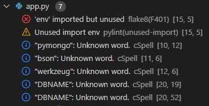
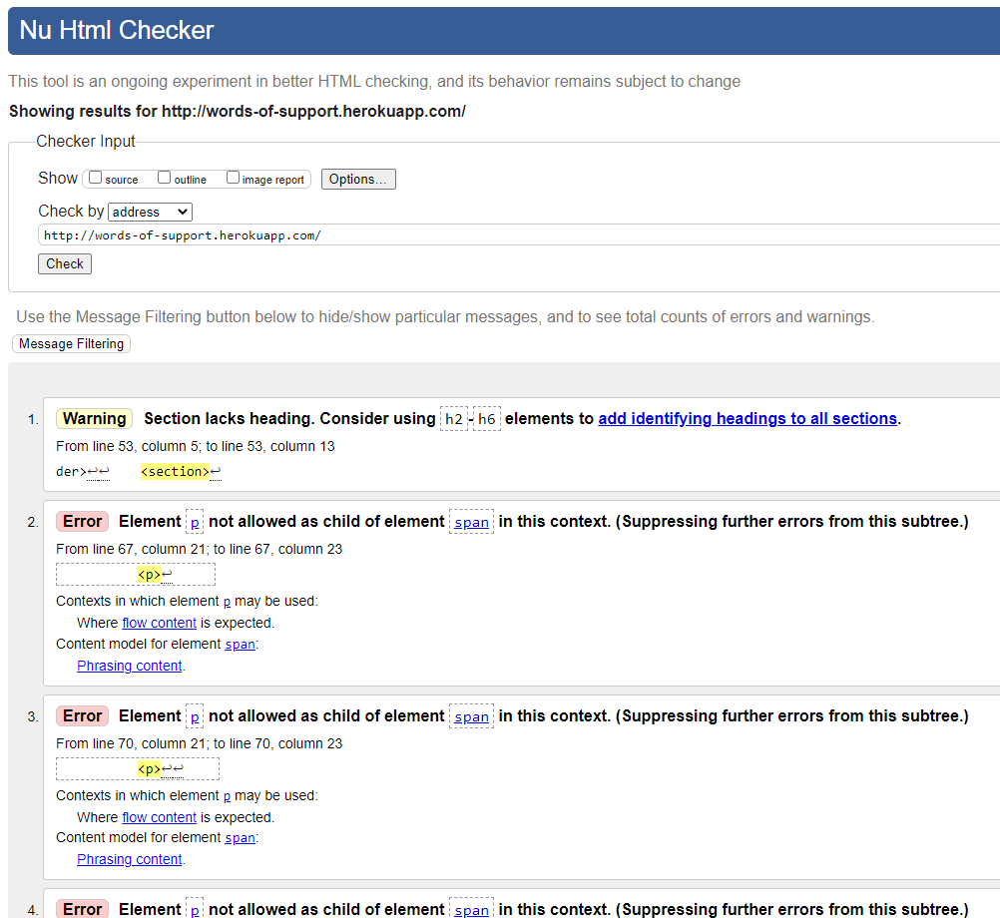
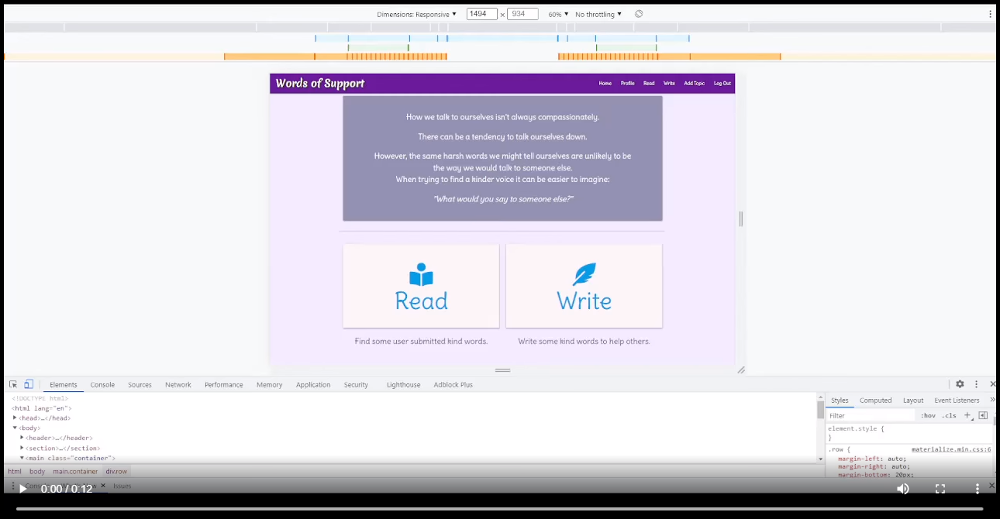

# Testing

## PEP8 Standard Linters
### Expected
The code is expected to pass without any major issues highlighted.
### Test
flake8 & pylint was used throughout the development to check compliance.
### Result
There were a number of issues that cropped up throughout development, but there were able to be corrected easily going along. The vast majority of these were warnings about "lines too long".  
  
At the end of the project the only errors showing were those related to the `env.py` file that cound't be helped due to the nature of it.

## WC3 Markup Validation 
### Expected
The site is expected to pass validation with no errors.
### Test
I supplied the Live Heroku address of the site to [The WC3 Markup Validation Service](https://validator.w3.org/) and ran the test.
### Result
  
There were numerous errors, all relating the the use of paragraph elements *within* span elements.
Additionally on the Read page there was an error of duplicate `id`s.
There were also warnings regarding the use of header tags
### Fix
I changed the span tag that was causing the error into a div. I altered the values of the duplicate `id`s so that they no longer matched, fortunately my Python code is using the value from `name` rather than `id` so there was no negative consequences to changing the `id` vales.
The heading is something that could be addressed in the future, generally there could be better use of sematic markup throughout the project.

## Responsiveness
### Expected
Throughout the different sections the design should remain well laid out regardless of the device size
### Test
Using Google Developer Tools I changed to each device available to see how the layout out looked, as well as using the "responsive" layout and changing the shape and size of the viewport with the drag handles. I did this repeatedly during the development process and again at the end.
### Result
Throughout development, on occasion I discovered elements that were not displaying how I thought they ought to be, for example appearing off the screen or out of alignment with other elements. However, by the end I was satisfied that the elements were all appearing in a satisfactory position / proportion.  
   
### Fix
As and when issues were spotted I amended styles for the elements to ensure that everything fit and flowed. Where necessary I added media queries or used Materialize classes for different device sizes or orientation.

## Functionality
### Expected
That the user will be able to navigate and perform CRUD actions without experiencing errors.
### Test
I ran through the site performing each of the actions along the different pathways that a user could take.
### Result
I encountered an issue when trying to register a new user. After creating a new user the app redirects to the profile page, but I had neglected to create the same session data when registering as was created when signing in.
### Fix
One line added to the register function to create the required session data.
`session["user_email"] = request.form.get("email").lower()`

## Performance
### Expected

### Test
Using Lighthouse from Chrome Developer tools...
### Result

### Fix

### Unresolved
Unfortunately I do want to remove the fonts that I am getting from Google Fonts, so it is still there slowing things up slightly.
 
 
## Accessibility
### Expected
The site should not have any major accessibility issues as shown by accessibility tests.
### Test
Using Lighthouse from Chrome Developer tools....
### Result
 
### Fix

 
 
## SEO
### Expected
No major issues to show from SEO report.
### Test
Using Lighthouse from Chrome Developer tools, I ran a report.
### Result

### Fix

 
## Usability
### Expected
That users should be able to use the site ........
### Test
Throughout development....
### Result

### Fix
